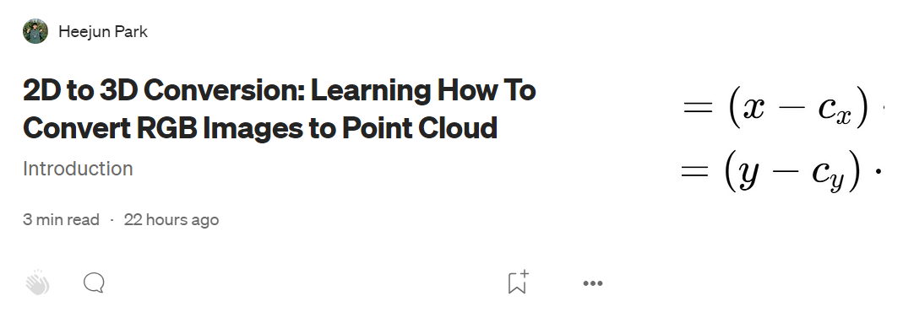
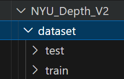
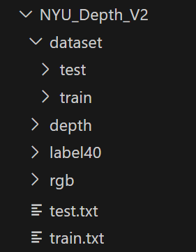

# NYUDepthV2_PointCloud_Converter

## What is this repository for?!
The purpose of this repo is to help you convert NYU Depth V2 Dataset into a Point Cloud Dataset. I wanted to test how well 3D Semantic Segmentation (like PointTransformerV3) models can be trained on 2D Depth and 2D RGB images.

## Prerequisites
Below are some knowledge that you need to understand how the reconstruction works.
- Depth Image
- Point Cloud
- Coding & Tech skills (Linux, Python, Numpy, Conda, Shell)
- 3D Reconstruction (2D Image Coordinate System → 3D Camera Coodinate System)
    - If you do not know about 3D reconstruction, then read this post, written by me :D [3D Recon](https://medium.com/@parkie0517/2d-to-3d-conversion-learning-how-to-convert-rgb-images-to-point-cloud-025a1fd77abe)  
    

## What I need to do
This is for my own reference, you do not need to read this section.
- Download the NYU Depth V2 Data ✅
    - RGB, Depth, Label40, train.txt, test.txt
    - Check if they are downloaded well
    - RGB was downloaded from [Github Repo](https://github.com/ankurhanda/nyuv2-meta-data?tab=readme-ov-file)
    - I got the rest from my colleague (Ph.D. Course Soyun Choi)
- Donwload S3DIS [Download Form](https://docs.google.com/forms/d/e/1FAIpQLScDimvNMCGhy_rmBA2gHfDu3naktRm6A8BPwAWWDv-Uhm6Shw/viewform?c=0&w=1&fbzx=5903082483074287663) ✅
    - Understand how S3DIS is composed
    - Okay each data sample has annotations foler and the PC data
    - I can never ever ever convert NYU into this format....
    - So, I need to convert NYU into the preprocessed format of the S3DIS
- Find the neccessary matrices for the conversion process ✅
    - Understand how NYU depth V2 is formatted
    - Find out if the data have been aligned already.
        - Guess what?! The rgb and depth images are already synchronized! meaning that the pixels in the same coordinate represents the same location!
        - So I only need the intrinsic matrix that converts the rgb and depth images to the 3D camera coordinate system
    - Acquire the camera intrinsics (can be acquired from NYU Depth V2's toolbox. it is inside camera_params.m file)
        - f_x, f_y, c_x, c_y
- Preprocess the data ✅
    - put them in the correct directory
    - make the files names' correct
- Create the conversion code ✅
- Split into train and test ✅
- Create a visualization code ⬜
- Complete writing the github README file to share knowledge with others! ✅

## NYU Dataset Description 
This is how the converted dataset is going to be structed in the end.  
  

| Dataset | Number of Data | Size (GB) | Average Data Size (MB) |
|---------|----------------|-----------|------------------------|
| Train   | 795            | 16        | 20.13                  |
| Test    | 654            | 13        | 19.88                  |

## Prepare NYU Depth V2 Data ⬜
The simplest way is to download the whole NYU dataset. However it's too big. So I will tell you a faster way to download the files that you need.
- RGB(train & test): [ankurhanda/nyuv2-meta-data](https://github.com/ankurhanda/nyuv2-meta-data?tab=readme-ov-file)
- Depth, Label, train.txt, test.txt: LINK TO BE CREATED SOON
- calibration information: [Goto download section and click on toolbox](https://cs.nyu.edu/~fergus/datasets/nyu_depth_v2.html)

Okay now that you have downloaded everything, unzip them all! Then, make sturcture your directory like the image below.  
  
The ./dataset/train and ./dataset/test should be empty. And depth, label40, rgb folders should have the images from 000001.png to 001449.png.

## 1. Installation
Follow the instructions below.
- conda create -n NYUDv2 python=3.11
- conda activate NYUDv2
- pip install numpy opencv-python open3d
- conda install pytorch::pytorch

## 2. Code Usage
If you run into any "missing moudle" erros when running the code please install the missing modules.
- Converting
    - python depth_2_pc.py NAME_OF_THE_DEPTH_IMAGE_FILE
- Visualizing
    - python visualize_pc.py NAME_OF_THE_POINT_CLOUD_FILE
 
## 3. Reuslt

