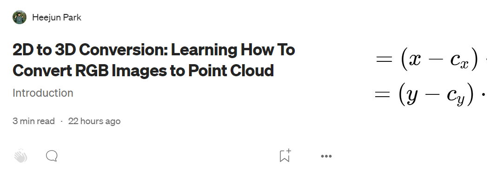
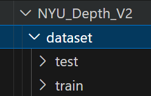
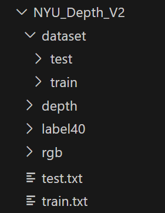

# NYUDepthV2_PointCloud_Converter

## What is this repository for?
The purpose of this repo is to help you convert NYU Depth V2 Dataset into a Point Cloud Dataset. I wanted to test how well a 3D Semantic Segmentation model (like PointTransformerV3) can be trained on NYU Depth V2. In order to do so, I first had to convert NYU Depth V2 dataset into a Point Cloud dataset. The NYU Depth V2 Dataset I am converting has 1449 images in total. There are 41 classes including diverse objects. To view the names of the classes click [here](https://github.com/parkie0517/NYUDepthV2_PointCloud_Converter/blob/main/classes.txt). If you want to check out more about the NYU Depth V2 dataset, then click [here](https://cs.nyu.edu/~fergus/datasets/nyu_depth_v2.html).

## Visualization Reuslt
  

(Left: RGB, Middle: Depth, Right: Converted Point Cloud)

## Prerequisites
Below are some knowledge that you need to have in order to understand how my repo works. However, if you just want to use the conversion code, then you don't need to know about these knowledge.
- Depth Image
- Point Cloud
- Coding & Tech skills (Linux, Python, Numpy, Conda, Shell)
- 3D Reconstruction Process (2D Image Coordinate System → 3D Camera Coodinate System)
    - If you want to learn about 3D reconstruction, then read this post. It is written by me :D [3D Recon](https://medium.com/@parkie0517/2d-to-3d-conversion-learning-how-to-convert-rgb-images-to-point-cloud-025a1fd77abe)  
    

## NYU Dataset Description 
This is how the converted dataset is going to be structed after the conversion process is all over.  
  

| Dataset | Number of Data | Total Size (GB) | Average Data Size (MB) |
|---------|----------------|-----------------|------------------------|
| Train   | 795            | 16              | 20.13                  |
| Test    | 654            | 13              | 19.88                  |

## Prepare NYU Depth V2 Data
The simplest way is to download NYU dataset is to just download the whole NYU dataset. However the size is too big. So I will tell you a faster way to download the files that you need.
- RGB(train & test): [ankurhanda/nyuv2-meta-data](https://github.com/ankurhanda/nyuv2-meta-data?tab=readme-ov-file)
- Depth, Label, train.txt, test.txt: LINK TO BE CREATED SOON
- calibration information: [Goto download section and click on toolbox](https://cs.nyu.edu/~fergus/datasets/nyu_depth_v2.html)

Okay now that you have downloaded everything, unzip them all! Then, make the sturcture of your directory looks like the image shown below.  
  
The 'train' and 'test' folders should be empty. 'depth', 'label40' and 'rgb' folders should have the images from '000001.png' to '001449.png'.

## Environment Setup
Follow the instructions below.
- conda create -n NYUDv2 python=3.11
- conda activate NYUDv2
- pip install numpy opencv-python open3d
- conda install pytorch::pytorch

## Converting to Point Cloud
If you run into any "missing moudle" errors when trying to run the code, please install the missing module.
- 1. Converting the whole NYU dataset to Point Cloud
    - open ./depth_2_pc_complete.py and change the following things.
    - input_path: the path of your unconverted data are stored
    - output_path: the paht of your 'dataset' folder
    - scale: this is used to scale down the converted point cloud. if you don't want to scale the point cloud, then make it 1
    - now run the code below!
    - python depth_2_pc_complete.py
    - make sure that the files have been converted properly by checking the 'dataset' folder. there should be from '000001.pth' to '001449.pth' files in the 'dataset' folder.
    - now run this code to split the data into train and test 
    - ./tools/split_dataset.py
    - after running the code above, files should be moved into the 'train' and 'test' folder automatically

## Visualizing the Converted Point Cloud
    - run the code below to change a png file into a 'pcd' file format (pcd is 'point cloud data')
    - python ./depth_2_pc.py PATH_OF_THE_INPUT_DEPTH_IMAGE
    - then, you will see a 'output.pcd' file
    - now run the code below
    - python visualize_pc.py NAME_OF_THE_POINT_CLOUD_FILE

## What I need to do
This is for my own reference.
- Download the NYU Depth V2 Data ✅
    - RGB, Depth, Label40, train.txt, test.txt
    - Check if they are downloaded well
    - RGB was downloaded from [Github Repo](https://github.com/ankurhanda/nyuv2-meta-data?tab=readme-ov-file)
    - I got the rest from my colleague (Ph.D. Course Soyun Choi)
- Donwload S3DIS [Download Form](https://docs.google.com/forms/d/e/1FAIpQLScDimvNMCGhy_rmBA2gHfDu3naktRm6A8BPwAWWDv-Uhm6Shw/viewform?c=0&w=1&fbzx=5903082483074287663) ✅
    - Understand how S3DIS is composed
    - Okay each data sample has annotations foler and the PC data
    - I can never ever ever convert NYU into this format....
    - So, I need to convert NYU into the preprocessed format of the S3DIS
- Find the neccessary matrices for the conversion process ✅
    - Understand how NYU depth V2 is formatted
    - Find out if the data have been aligned already.
        - Guess what?! The rgb and depth images are already synchronized! meaning that the pixels in the same coordinate represents the same location!
        - So I only need the intrinsic matrix that converts the rgb and depth images to the 3D camera coordinate system
    - Acquire the camera intrinsics (can be acquired from NYU Depth V2's toolbox. it is inside camera_params.m file)
        - f_x, f_y, c_x, c_y
- Preprocess the data ✅
    - put them in the correct directory
    - make the files names' correct
- Create the conversion code ✅
- Split into train and test ✅
- Create a visualization code ✅
- Complete writing the github README file to share knowledge with others! ✅
